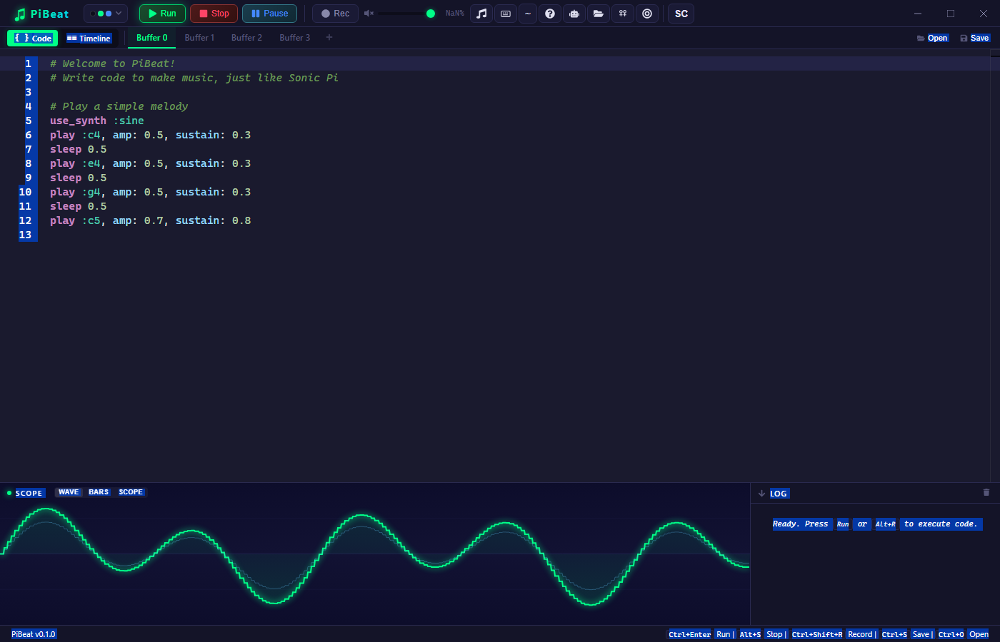
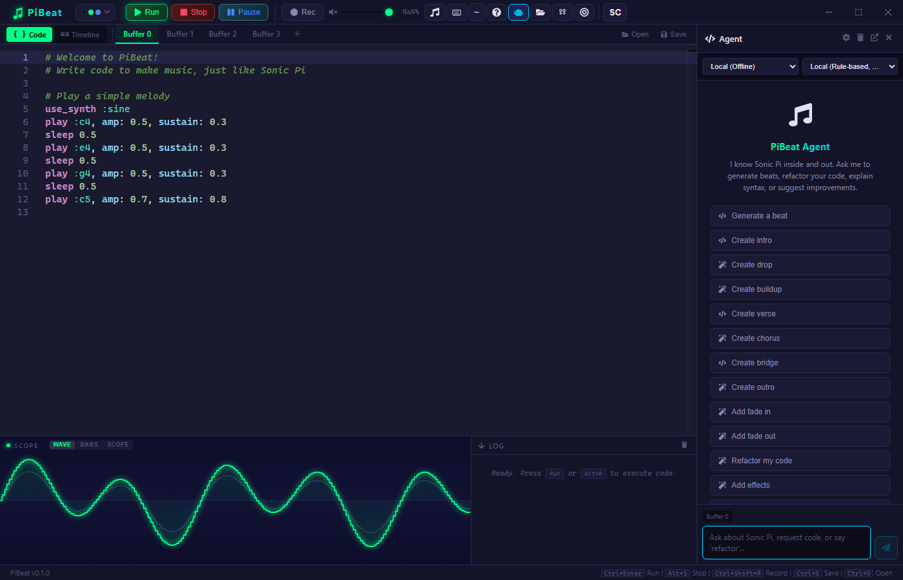
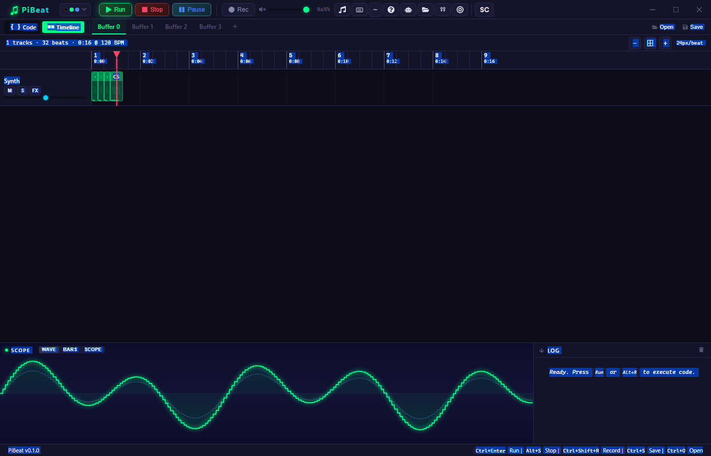

# PiBeat

A modern Digital Audio Workstation powered by SuperCollider and Sonic Pi, with AI-assisted music coding capabilities.

## 🎵 What is PiBeat?

PiBeat is a live-coding music environment that combines:
- **SuperCollider** audio engine for real-time synthesis
- **Sonic Pi** inspired syntax for intuitive music creation
- **AI Agent** with GPT-5, GPT-4, and Claude support for code generation
- **Real-time editing** with Monaco Editor and live code execution
- **Visual feedback** with waveform visualization and effects panels

## 📸 Screenshots

| Editor & Waveform | Agent Chat |
|:-:|:-:|
|  |  |

| Timeline View | Band Visualizer |
|:-:|:-:|
|  |  |

## 🚀 Quick Start

1. **Install Dependencies**
   ```powershell
   npm install
   ```

2. **Set up SuperCollider** (one-time setup)
   ```powershell
   .\setup_sc.ps1
   ```

3. **Run the Application**
   ```powershell
   npm run tauri dev
   ```

## 📖 Documentation

Comprehensive documentation is available in the [docs/](docs/) folder:

- **[Agent Guide](docs/AGENT_GUIDE.md)** - Set up and use the AI agent (OpenAI, Anthropic, Local)
- **[Debugging Guide](docs/DEBUGGING_AGENT.md)** - Troubleshoot API and agent issues
- **[Parser Limitations](docs/PARSER_LIMITATIONS.md)** - Supported Sonic Pi features
- **[Reactive Agent Features](docs/REACTIVE_AGENT_FEATURES.md)** - Advanced agent capabilities
- **[LLM API Compatibility](docs/LLM_API_COMPATIBILITY.md)** - OpenAI/Anthropic API reference

👉 See [docs/README.md](docs/README.md) for the complete documentation index.

## 🛠️ Tech Stack

- **Frontend**: React + TypeScript + Vite
- **Backend**: Rust + Tauri
- **Audio**: SuperCollider (scsynth + UGens)
- **AI**: OpenAI GPT / Anthropic Claude / Local pattern-matching
- **Editor**: Monaco Editor (VS Code engine)

## � Why the name PiBeat?

PiBeat reflects the evolution from code-driven sound to structured electronic production.

The name subtly nods to the mathematical precision behind Sonic Pi (π), while "Beat" anchors it firmly in modern electronic music. It represents the fusion of logic and rhythm — where deterministic timing meets creative expression.

**PiBeat stands for:**
- Code-native music creation
- Structured electronic composition
- Mathematical precision turned into rhythm
- A serious production environment with playful roots

**It's where π becomes pulse.**

## �🎹 Features

- ✅ **Live coding** with instant audio feedback
- ✅ **AI-powered code generation** (techno beats, ambient pads, drum patterns, etc.)
- ✅ **Multiple buffers** for organizing different musical sections
- ✅ **Sample browser** with 400+ built-in samples
- ✅ **Synth browser** with 40+ synthesizers
- ✅ **Effects panel** with reverb, delay, distortion, filters, and more
- ✅ **Waveform visualization** in real-time
- ✅ **CUE markers** for looping and navigation
- ✅ **50+ scales and 20+ chord types** for music theory
- ✅ **Pattern generation** with rings, spreads (Euclidean rhythms), randomization

## 🔧 Development

### Recommended IDE Setup

- [VS Code](https://code.visualstudio.com/) 
- [Tauri Extension](https://marketplace.visualstudio.com/items?itemName=tauri-apps.tauri-vscode) 
- [rust-analyzer](https://marketplace.visualstudio.com/items?itemName=rust-lang.rust-analyzer)

### Build for Production

```powershell
npm run tauri build
```

## 📜 License

This project is built on top of:
- **SuperCollider** (GPL v3)
- **React** (MIT)
- **Tauri** (MIT/Apache-2.0)

## 🤝 Contributing

1. Update documentation when adding features
2. Keep `.github/copilot-instructions.md` in sync for the AI agent
3. Test with Local, OpenAI, and Anthropic modes before committing
4. Follow existing code style and patterns

---

**Made with ❤️ for live coders and experimental musicians**
